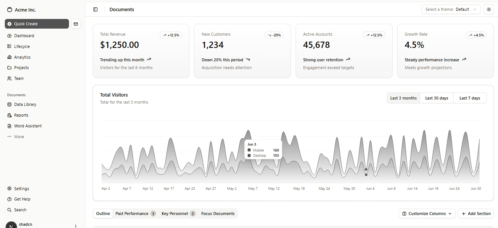
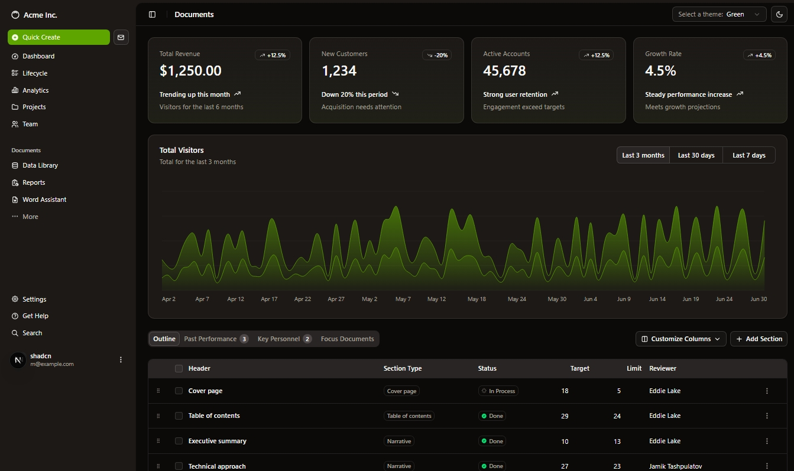

# Admin Dashboard With Next.js and Shadcn

This project is an admin dashboard built with Next.js and ShadCn. The dashboard comes with a rich UI that includes light and dark modes and several attractive themes.

Besides using Next.js capabilities to implement this dashboard, I have included many modern js packeges in this project:

- **TypeScript** for type safety
- **Shadcn UI**

You can watch a live version of this project by clicking [here]()
